# Data Analyst Portfolio — Duong Thi Yen Linh

**Email**: selina.duong97@gmail.com 

**Phone**: +84 354 241 419 

**Location**: Binh Duong, Vietnam 

**LinkedIn**: [LinkedIn Dương Thị Yến Linh](www.linkedin.com/in/dương-thị-yến-linh-140a67216)

**GitHub**: [Github Dương Thị Yến Linh](https://github.com/SelinaYenLinh)

Entry‑level Data Analyst with a forecasting background. Hands‑on with SQL, Power BI (DAX/M), Python (Pandas), and data storytelling. Built sales & operations dashboards and contributed to ~+10% forecast‑accuracy via seasonality and standardized inputs.

### Highlights / Achievements  
- Contributed to +10% forecast‑accuracy by standardizing inputs and integrating seasonality into analysis & dashboards.

- Power BI storytelling dashboards (cards → trends → drill‑through) improving business visibility and reducing manual reporting.

- ETL automation with VBA/Power Query, cutting report prep time (fill actual: ↓X%).

**Tech Stack**: SQL · Power BI (DAX/M) · Python (Pandas/Matplotlib) · Excel/Power Query · Star Schema · Basic ML/Forecasting

## Projects

#### **Power BI Sales & Operations — Storytelling Dashboard**  
**Goal**: Give leadership and planners a clear narrative of performance (Sales/Inventory/Delivery) within 30 seconds.  
**Dataset**: Orders/Items, Customers, Products, Dates (sample or anonymized real structure).  
**Model**: Star Schema (Fact Orders/Items; Dim Customers/Products/Dates).  
**Key KPIs**: Gross Sales, Margin, Stock Coverage, Stockout Rate, OTIF/Lead Time.  
**Visual Design**: Cards → Trend → Drill‑through; role‑based pages (Director / Sales / Ops).  
**Performance**: load < 3s (fill); refresh daily/weekly (fill); adoption +N MAU (fill).  
Stack: Power BI, DAX/M, SQL, Power Query.  

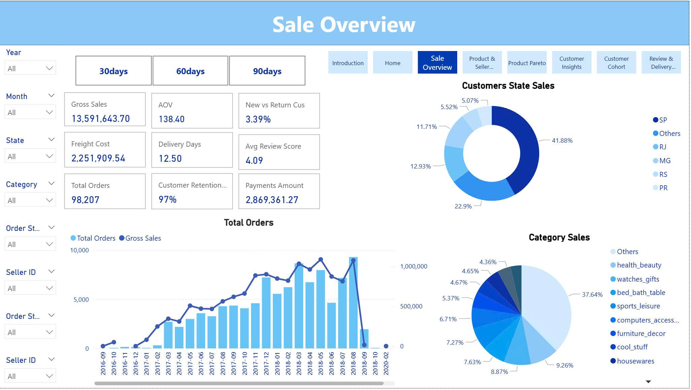

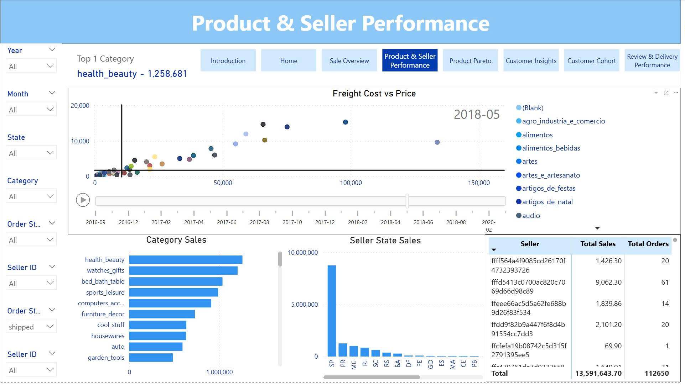

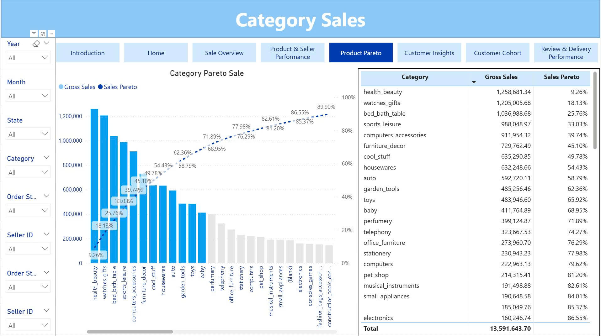

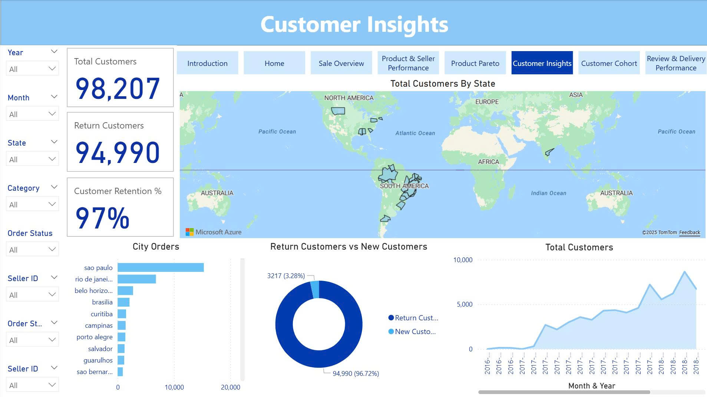

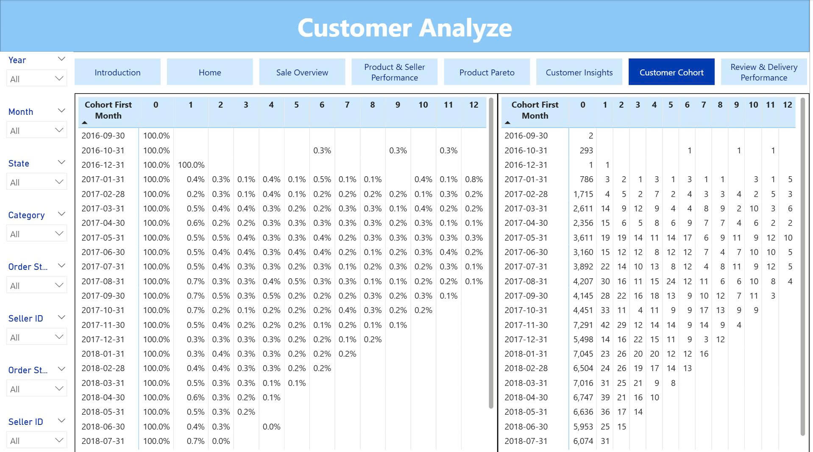

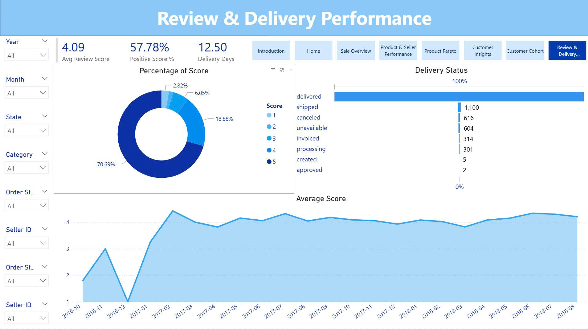

#### **Python — EDA (Roller Coaster Design Evolution)**
### 🎢 *Exploring the evolution of roller coaster designs using Python & Pandas*

## 📌 Project Overview


This project demonstrates an end-to-end **Exploratory Data Analysis (EDA)** pipeline on a dataset of roller coasters. It highlights the trends in design, performance, and engineering characteristics over time.

**Key Skills Demonstrated:**
- Data cleaning & preprocessing (Pandas)
- Data visualization (Matplotlib & Seaborn)
- Aggregation & statistical analysis
- Correlation & trend analysis by decade
- Reporting with ydata-profiling

---

## 🔧 Tools & Libraries

```python
pandas, matplotlib, seaborn, ydata_profiling
```

📁 Dataset [Download](https://www.kaggle.com/datasets/robikscube/rollercoaster-database)

🧩 Step-by-Step Process

1. 📥 Data Understanding

- Load the dataset with Pandas

- Explore the dataset shape, column types, and missing values

- Display descriptive statistics and top rows

    ```python
    df = pd.read_csv("coaster_db.csv")

    print(df.shape)
    print(df.head(10))
    print(df.columns)
    print(df.dtypes)
    print(df.describe())
    ```


Inspect structurer 

2. 🧹 Data Cleaning & Preparation

- Drop irrelevant columns to focus on key engineering and location metrics

    ```python
    df = df[[
    'coaster_name','Location','Status','Manufacturer','year_introduced', 'latitude', 'longitude','Type_Main','opening_date_clean','speed_mph','height_ft','Inversions_clean', 'Gforce_clean'
    ]].copy()
    ```
- Convert data types (e.g., date fields)

    ```python
    df["opening_date_clean"] = pd.to_datetime(df["opening_date_clean"])
    ```

- Rename columns for consistency and readability

    ```python
    df = df.rename(columns={
    'coaster_name': 'Coaster Name',
    'year_introduced': 'Year Introduced',
    'latitude': 'Latitude',
    'longitude': 'Longitude',
    'Type_Main': 'Type Main',
    'opening_date_clean': 'Opening Date Clean',
    'speed_mph': 'Speed MPH',
    'height_ft': 'Height FT',
    'Inversions_clean': 'Inversions Clean',
    'Gforce_clean': 'Gforce Clean'
    })
    ```

- Handle missing values using mean/mode imputation
    
    ```python

    for col in ['Latitude', 'Longitude', 'Speed MPH', 'Height FT', 'Gforce Clean']:
    df[col] = df[col].fillna(df[col].mean())

    for col1 in ['Status', 'Manufacturer', 'Opening Date Clean']:
    df[col1] = df[col1].fillna(df[col1].mode()[0])
    ```

- Remove duplicate entries

    ```python
    df = df.loc[~df.duplicated(subset=['Coaster Name', 'Location', 'Opening Date Clean'])] \
       .reset_index(drop=True)

    df = df.sort_values('Year Introduced', ascending=True) \
       .drop_duplicates(subset=['Coaster Name', 'Location', 'Opening Date Clean'], keep='first') \
       .reset_index(drop=True)
    ```
3. 📊 Exploratory Visualizations
    
- Yearly trends in coaster introductions

    
    ```python
    ax = df['Year Introduced'].value_counts().head(10).plot(kind='bar', title="Top 10 Year Introduced")
    ax.set_xlabel("Year")
    ax.set_ylabel("Count")
    plt.show()
    ```


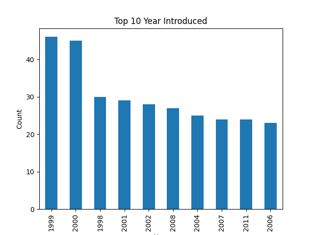

- Distribution of coaster speeds and heights

    ```python
    ax = df['Speed MPH'].plot(kind='hist', bins=20, title="Speed MPH")
    ax.set_xlabel(["Speed MPH"])
    ```

    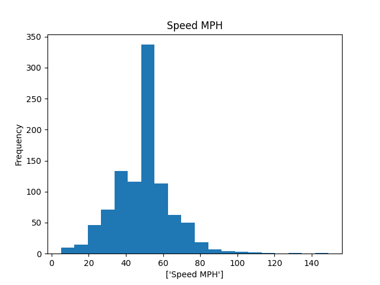

    ```python
    ax = df['Speed MPH'].plot(kind='kde', title="Speed MPH")
    ax.set_xlabel('Speed MPH')
    plt.show()
    ```

    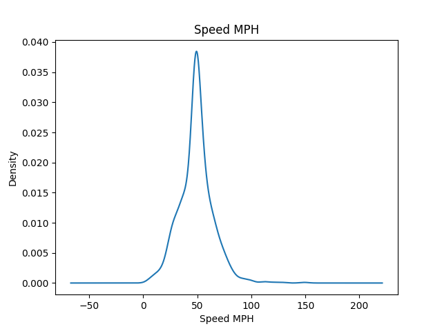

- Categorical distributions (e.g., coaster types)

    ```python
    ax = df['Type Main'].value_counts().plot(kind='bar')
    plt.show()
    ```

    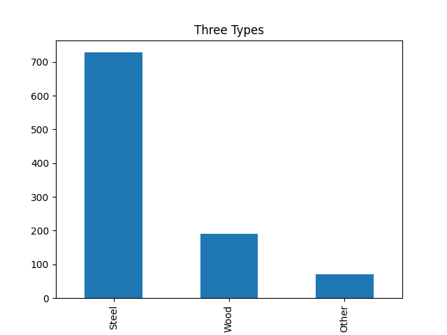
    

- Scatterplots: Speed vs Height, with color by year
    
    ```python
    df.plot(kind='scatter', x='Speed MPH', y='Height FT', title='Coaster Speed vs Height')
    ```

    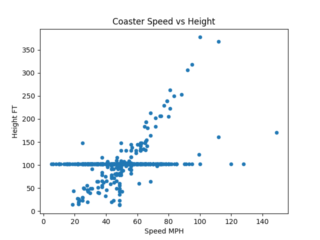

    ```python
    ax = sns.scatterplot(x='Speed MPH', y='Height FT', hue='Year Introduced', data=df)
    ax.set_title('Coaster Speed vs Height')
    ```

    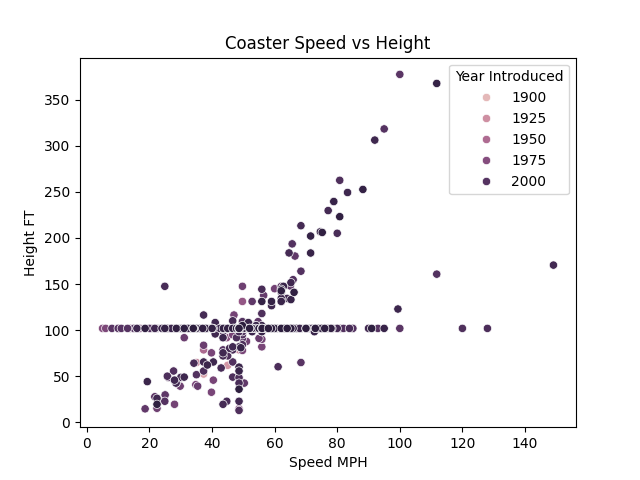
    
4. 🔗 Feature Relationships
- Pair plots by Type
    
    ```python
    sns.pairplot(df,
             vars=['Year Introduced', 'Speed MPH', 'Height FT', 'Inversions Clean', 'Gforce Clean'],
             hue='Type Main')
    plt.show()
    ```
    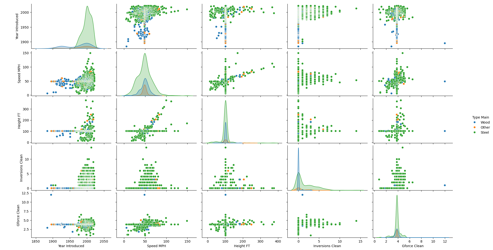
- Correlation heatmap of key numeric features

    ```python
    df_corr = df[['Year Introduced', 'Speed MPH', 'Height FT', 'Inversions Clean', 'Gforce Clean']].dropna().corr()
    sns.heatmap(df_corr, annot=True)
    plt.show()
    ```
    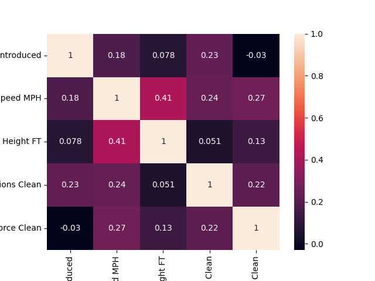
5. 📈 Advanced Trend Analysis
- Average Speed by Coaster Type
    ```python
    compared = df.groupby('Type Main')['Speed MPH'].mean().sort_values(ascending=False)

    df['Decade'] = ((df['Year Introduced'] // 10) * 10).astype('str') + "s"

    avg_by_decade = df.groupby('Decade')[['Year Introduced', 'Speed MPH', 'Height FT', 'Inversions Clean', 'Gforce Clean']] \
                    .mean().round(2).reset_index()
    ```

    
- Design evolution by decade (e.g., higher speeds and heights in 2000s+)
    
    ```python
    ax = avg_by_decade.plot(
    x='Decade',
    y=['Speed MPH', 'Height FT', 'Inversions Clean', 'Gforce Clean'],
    kind='line',
    marker=0,
    title='Roller Coaster Design Trend By Decade'
    )
    ax.set_ylabel('Average Value')
    plt.grid(True)
    plt.show()
    ```

    

- Multi-metric line and bar charts for insights across decades
    
    ```python
    ax = avg_by_decade.plot(kind='bar', x='Decade', y='Speed MPH', title='Average Speed By Decade')
    plt.show()
    ```

    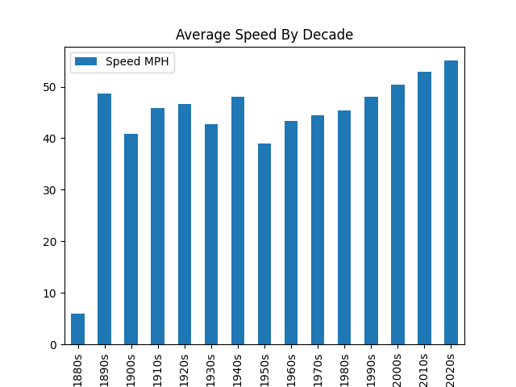

🔍 Key Insights  
- Coaster speed and height have significantly increased over decades

- Types of coasters (e.g., steel vs wooden) show distinct design trends

- Modern coasters are not only faster but also more intense (higher G-force)

📝 Bonus: Automated EDA Report
- An optional HTML report was generated using ydata_profiling for deeper automated insight.

```python
profile = ProfileReport(df, title="EDA Report")
profile.to_file("EDA_Report.html")
```


#### **Smart Loan Recovery System - Machine Learning**
**Features**:   
- Data visualization using Plotly  
- Data preprocessing pipeline  
- Clustering borrowers via KMeans  
- Classification using RandomForest  
- Evaluation metrics & model export  
- Modular structure for maintainability  

**Model Training & Evaluation**:
- Clustering: KMeans (4 clusters)  
- Segment borrowers into risk profiles (from 0 to 4).  
- Classification: Random Forest  
- Label segments as recoverable or not.  
- Metrics:  
    - Accuracy: 96%  
    - Precision: 91%  
    - Recall: 97%  
    - F1 Score: 94%  

**🧾 Dependencies**:
- Key libraries:  
    - pandas, scikit-learn  
    - plotly, matplotlib, seaborn  
    - yaml    