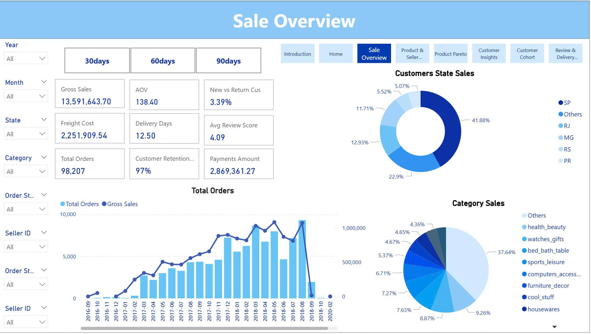

# Data Analyst Portfolio — Duong Thi Yen Linh

**Email**: selina.duong97@gmail.com 

**Phone**: +84 354 241 419 

**Location**: Binh Duong, Vietnam 

**LinkedIn**: [LinkedIn Dương Thị Yến Linh](www.linkedin.com/in/dương-thị-yến-linh-140a67216)

**GitHub**: [Github Dương Thị Yến Linh](https://github.com/SelinaYenLinh)

Entry‑level Data Analyst with a forecasting background. Hands‑on with SQL, Power BI (DAX/M), Python (Pandas), and data storytelling. Built sales & operations dashboards and contributed to ~+10% forecast‑accuracy via seasonality and standardized inputs.

### Highlights / Achievements  
- Contributed to +10% forecast‑accuracy by standardizing inputs and integrating seasonality into analysis & dashboards.

- Power BI storytelling dashboards (cards → trends → drill‑through) improving business visibility and reducing manual reporting.

- ETL automation with VBA/Power Query, cutting report prep time (fill actual: ↓X%).

**Tech Stack**: SQL · Power BI (DAX/M) · Python (Pandas/Matplotlib) · Excel/Power Query · Star Schema · Basic ML/Forecasting
## Projects

### [Power BI — Sales & Operations Storytelling](https://github.com/SelinaYenLinh/Power-BI-Brazilian_E-Commerce.git)
**Goal:** 30s narrative for leaders on **Sales / Inventory / Delivery** using a **Star Schema** (Fact Orders/Items; Dim Customers/Products/Dates).  
**KPIs:** Gross Sales, Margin, Stock Coverage, Stockout Rate, OTIF/Lead Time.  
**Design:** Cards → Trends → **Drill-through**; role pages (Director / Sales / Ops).  
**Results:** load **<3s**, refresh **daily/weekly**  
**Stack:** Power BI, DAX/M, SQL, Power Query  
**Screenshots:**  

---

### [Python — EDA: Roller Coaster Design Evolution](https://github.com/SelinaYenLinh/Exploratory-Data-Analysis.git)
**Goal:** Clean & analyze the evolution of coaster design by decade.  
**Skills:** cleaning/preprocessing, aggregation, correlations, trend-by-decade, **ydata-profiling**.  
**Findings:** Speed and height increased significantly over time; steel vs. wooden coasters show contrasting trends; modern coasters exhibit higher G-forces. 
**Stack:** Pandas, Matplotlib, Seaborn, ydata-profiling  
**Screenshots:**  

---

### [Smart Loan Recovery System — Machine Learning](https://github.com/SelinaYenLinh/Smart-Loan-Recovery-System-With-Machine-Learning.git)
**Goal:** Segment borrowers and predict recovery success to support strategy decisions.
**Features:** KMeans segmentation, RandomForest classification, Plotly visuals, pipeline modules, model export.  
**Results (sample):** Accuracy **96%**, Precision **91%**, Recall **97%**, F1 **94%** 
**Stack:** pandas, scikit-learn, plotly, matplotlib, seaborn, yaml  
**Screenshots:**  

### [Nghiệm Kho + GPS — Excel/VBA Automation](https://github.com/SelinaYenLinh/Warehouse-Management.git)

**Goal**: Automate warehouse auditing and GPS tracking for internal transportation operations.
**Features**: Audit Log, Machine_ID validation, GPS log import, Google Apps Script sync, animated Excel UI.  
**Results** : Reduced manual audit time by ~40%, improved data accuracy & traceability.  
**Stack**: Excel VBA, Google Apps Script, Power Query, JSON API  

